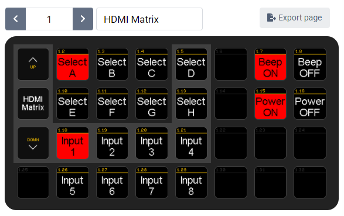

# companion-module-blackbird-hdmimatrix

This module will allow you to control a [Monoprice](https://www.monoprice.com/) Blackbird™ HDMI Matrix from an Elgato Stream Deck using Bitfocus Companion.

Has only been tested with the following models. Although it may work with other Blackbird™ HDMI Matrix models with the TCP/IP Web based GUI.

- Blackbird™ HDMI Matrix 8x8 4K 60HZ HDR P/N 24180
- Blackbird™ HDMI Matrix 8x8 4K 60HZ HDR P/N 39665

You can find sample a Companion configuration file [here](sample-configs/blackbird-hdmimatrix-sample-config.companionconfig).

See [HELP.md](./HELP.md) and [LICENSE](./LICENSE)
